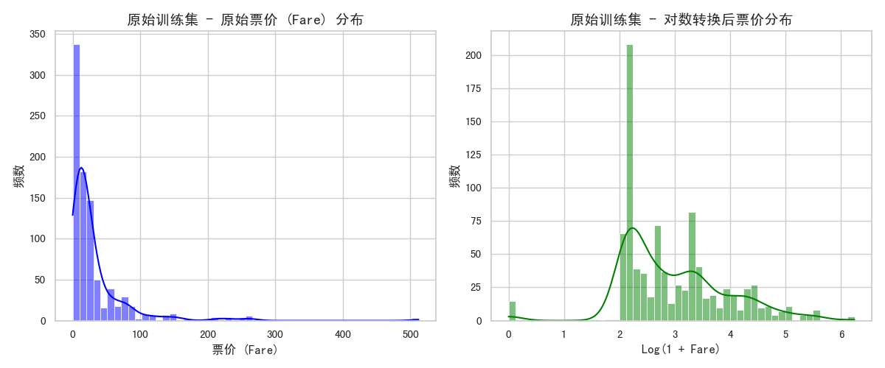
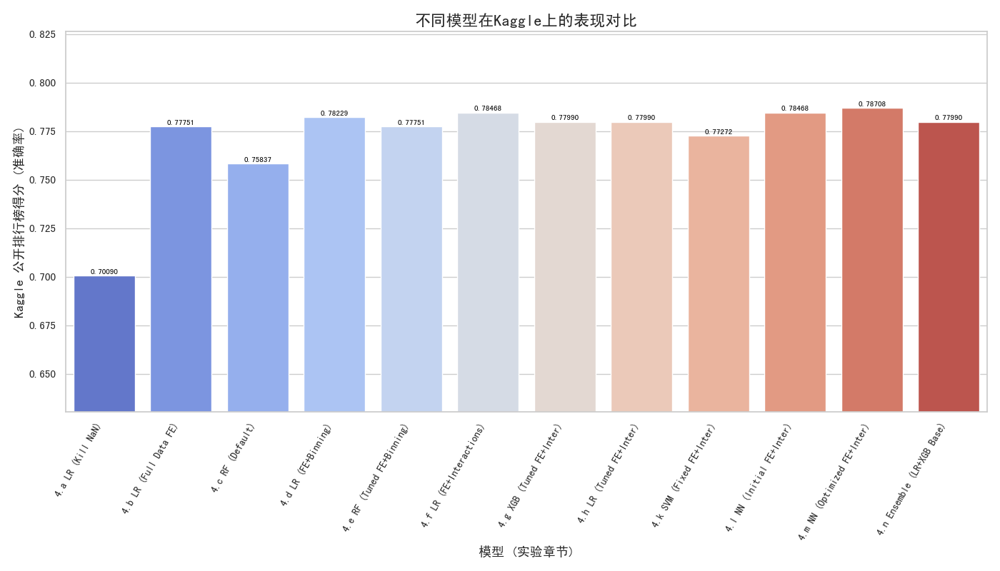

# **泰坦尼克号生存预测实验总结与分析报告**

## 摘要
本项目旨在通过对泰坦尼克号乘客数据的分析、数据清洗、特征工程以及多种机器学习模型的应用与调优，预测乘客的生还可能性。实验过程系统地探索了不同数据处理策略、特征组合以及模型算法（包括逻辑回归、随机森林、支持向量机、梯度提升机、神经网络以及集成学习）对预测性能的影响。最终，通过对基础模型进行软投票集成的策略，在Kaggle公开排行榜上取得了与优化后神经网络模型持平的最佳准确率0.78708。本报告将详细回顾实验的关键步骤、对比分析各阶段成果，并总结经验教训。

## 1 引言
泰坦尼克号沉船事件是历史上著名的悲剧之一。利用机器学习技术分析乘客数据，预测其生还概率，不仅是一个经典的二分类问题，也为我们提供了理解灾难中生存因素的视角。本实验的目标是通过一系列数据处理和建模步骤，最大限度地提高生存预测的准确性。

## 2 数据探索与预处理回顾

### 2.1 原始数据概览与初步分析

​	原始数据集 (`train.csv`) 包含891条乘客记录。初步分析显示，`Age` 和 `Cabin` 列存在大量缺失值，`Embarked` 列存在少量缺失值。`Fare` 特征呈现显著的右偏分布。可视化分析揭示了部分特征与生存率之间的明显相关性。

_缺失值.png)

**图1**: 此图展示了原始训练数据集中各个特征列包含的缺失值百分比。可以清晰地看到，`Cabin` 列缺失最为严重（超过75%），其次是 `Age` 列（约20%），而 `Embarked` 列有少量缺失（小于1%)。这直观地呈现了数据质量问题，指导了后续对这些列的缺失值处理策略选择。

**图2**: 左侧子图显示了乘客原始票价 (`Fare`) 的分布，呈现出典型的高度右偏分布，大部分票价集中在较低区间。右侧子图展示了对 `Fare` 进行 `log(1+Fare)` 对数转换后的分布，可见转换后数据分布更加接近对称，偏度显著降低。这种转换有助于满足某些对特征分布敏感的模型（如逻辑回归）的需求，并可能改善模型性能。

_vs_生还率.png)

**图3**: 此图对比了男性和女性乘客的平均生存率。图中清晰地显示女性的生存率远高于男性，这印证了“妇女和儿童优先”的疏散原则，表明性别是一个非常强的预测特征。

_vs_生还率.png)

**图4**: 此图展示了不同船舱等级（1等舱、2等舱、3等舱）乘客的平均生存率。结果显示，船舱等级越高（1等舱最好），生存率也越高。这可能与船舱位置、社会地位以及获取救援的优先权有关，说明船舱等级也是一个重要的预测因子。

_vs_生还率.png)

**图5a**: 此图展示了从乘客姓名中提取的不同头衔 (`Title`) 的乘客平均生存率。例如，'Mrs'（夫人）和 'Miss'（小姐）的生存率显著高于 'Mr'（先生），而 'Master'（少爷）的生存率也相对较高。这反映了社会地位和年龄（如儿童通常有Master头衔）对生存概率的影响，说明头衔是一个富有信息量的衍生特征。

_vs_生还率.png)

**图5b**: 此图展示了不同家庭规模 (`FamilySize`) 的乘客平均生存率。可以看到，家庭规模适中（如2-4人）的乘客生存率往往高于独行（FamilySize=1）或家庭规模过大（FamilySize >= 5）的乘客。这提示我们家庭规模并非简单线性地影响生存率，可能存在一个最优区间，并且“是否独行”本身可能是一个有价值的特征 (`IsAlone`)。

_vs_生还率.png)

**图5c**: 此图展示了根据 `Cabin` 信息提取的乘客所在甲板 (`Deck`) 与生存率的关系（'U'通常代表缺失值或未知甲板）。不同甲板的生存率存在差异，例如B、D、E等甲板的生存率相对较高。这可能与这些甲板靠近救生艇的位置有关，说明船舱位置（即使是粗略的甲板信息）也是一个潜在的预测因子。

_vs_生还率.png)

*   **图5d解释**: 此图展示了将年龄分箱后的不同年龄段 (`AgeBin`) 乘客的平均生存率。可以看到，'Child'（儿童）的生存率最高，而随着年龄增长，生存率总体呈下降趋势，尽管'MiddleAged'的生存率略高于'Adult'和'Senior'。这种非单调关系说明将连续年龄分箱可以帮助模型捕捉到年龄对生存率的特定区间效应。

_vs_生还率.png)

**图5e解释**: 此图展示了将票价分箱后的不同票价区间 (`FareBin`) 乘客的平均生存率。图中显示票价越高，生存率越高，呈现出明显的趋势：'LowFare'生存率最低，'VeryHighFare'生存率最高。这与船舱等级的结论一致，高票价通常对应高等级船舱和更好的位置。将票价分箱同样有助于模型理解票价对生存率的非线性影响（例如，最高票价区间的提升可能比低票价区间更显著）。

_vs_生还率.png)

*   **图5f解释**: 此图对比了独行乘客 (`IsAlone`=1) 与非独行乘客 (`IsAlone`=0) 的平均生存率。可以看到，非独行乘客的生存率高于独行乘客。这进一步证实了家庭规模适中乘客生存率较高的观察，并将家庭规模的影响简化为一个重要的二元特征。

_vs_生还率.png)

*   **图5g**: 此图展示了不同登船港口 (`Embarked`) 乘客的平均生存率。C港口（Cherbourg）的乘客生存率最高，其次是Q港口（Queenstown），S港口（Southampton）最低。这可能与不同港口乘客的社会经济背景、船舱等级分布等因素有关。虽然不是衍生特征，但此图展示了该原始分类特征与生存率的关联。

### 2.2 数据清洗策略的影响

## **3. 特征工程探索**

特征工程是提升模型性能的关键环节。本实验中探索并应用了多种特征工程技巧：

- **基础特征**: FamilySize, IsAlone, Title。

- **基于Cabin的特征**: Deck。

- **数值特征分箱**: AgeBin, FareBin。

- **交互特征**: AgeBin_Pclass, Title_Pclass, Sex_Pclass。

- **编码与标准化**: 分类特征独热编码，数值特征标准化。

_vs_生还率.png)

- **图5**: 此图（通常包含多个子图）展示了如乘客头衔 (Title)、家庭规模 (FamilySize) 等衍生特征与生存率之间的关系。例如，某些头衔（如 'Mrs', 'Miss'）的乘客生存率较高，而家庭规模对生存率的影响则可能呈现非线性关系（例如，独行或过大家庭的生存率可能较低）。这验证了这些衍生特征的有效性。

## **4. 实验优化思维链路 (从4.a到4.n)** 

本项目的模型优化遵循一个迭代和逐步改进的逻辑链路，旨在通过系统性的实验来提升预测准确率：

### **4.a: 建立基线 (数据量不足的警示)**

   - 
   - **目标**: 快速搭建一个初始模型，了解基本性能。
   - **方法**: 使用少量未缺失数据（183行），应用逻辑回归，基本特征编码和标准化。
   - **结果**: 准确率约70.09% (本地)。
   - **启示**: **数据量严重不足是性能瓶颈**。必须采用更合理的缺失值处理策略。

  ### **4.b: 数据量恢复与基础特征工程**
   - 
   - **目标**: 提升数据量，引入初步的有效特征。
   - **方法**: 使用完整数据集，对Age（中位数）、Embarked（众数）进行填充，Cabin提取Deck（缺失填'U'）。引入Title, FamilySize特征。模型仍为逻辑回归。
   - **结果**: 准确率提升至 **0.77751 (Kaggle)**。
   - **启示**: **保留数据和合理的缺失值处理是关键**。基础特征工程有效。

  ### **4.c: 尝试不同模型 (随机森林初探)**
   - 
   - **目标**: 探索除逻辑回归外的其他模型潜力。
   - **方法**: 在4.b的特征基础上，使用随机森林（默认参数）。
   - **结果**: 准确率0.75837 (Kaggle)，不如4.b的逻辑回归。
   - **启示**: 复杂模型并非天然优于简单模型，**超参数调优非常重要**。

  ### **4.d: 深入特征工程 (分箱)**
   - 
   - **目标**: 针对逻辑回归，通过特征工程捕捉非线性关系。
   - **方法**: 在4.b的特征基础上，对Age和Fare进行分箱处理 (AgeBin, FareBin)。模型为逻辑回归。
   - **结果**: 准确率提升至 **0.78229 (Kaggle)**。
   - **启示**: **特征分箱能有效提升线性模型的表现**。
**4.e: 模型调优 (随机森林与GridSearchCV)**
   - 
   - **目标**: 对随机森林进行超参数调优，看其能否超越优化后的逻辑回归。
   - **方法**: 在4.d的特征基础上，对随机森林使用GridSearchCV调优。
   - **结果**: 准确率0.77751 (Kaggle)，仍未超过4.d的逻辑回归。
   - **启示**: 即使调优，模型选择和特征集的契合度依然重要。

  ### **4.f: 进一步特征工程 (交互特征)**
   - 
   - **目标**: 进一步挖掘特征间的潜在关系。
   - **方法**: 在4.d的特征基础上，为逻辑回归添加交互特征 (AgeBin_Pclass, Title_Pclass, Sex_Pclass)。
   - **结果**: 准确率提升至 **0.78468 (Kaggle)**，成为当时逻辑回归的最佳表现。
   - **启示**: **交互特征可以带来边际性能提升**。
**4.g - 4.k: 尝试更多模型与调优 (XGBoost, SVM)**
   - 
   - **目标**: 评估更多先进模型在当前最佳特征集上的表现。
   - **方法**: 分别在4.f的特征基础上，应用XGBoost (GridSearchCV), 逻辑回归 (GridSearchCV, 对比手动调参), SVM (固定参数/GridSearchCV)。
   - **结果**:
     - 
     - XGBoost (4.g): 0.77990 (Kaggle)
     - LR+GridSearchCV (4.h): 0.77990 (Kaggle)
     - SVM (4.k): 0.77272 (Kaggle)
   - **启示**: 在此特征集上，这些模型（包括调优后）并未超越4.f的手动调优逻辑回归。GridSearchCV并不总能找到比精心手动选择更优的参数（特别是在参数空间定义不够好的情况下）。

  ### **4.l: 引入神经网络 (初步尝试)**
   - 
   - **目标**: 探索深度学习模型在此任务上的潜力。
   - **方法**: 使用4.f的特征集，构建一个基础的多层感知机 (MLP) 神经网络。
   - **结果**: 准确率 **0.78468 (Kaggle)**，与4.f的逻辑回归持平。
   - **启示**: 神经网络具有潜力，但初始结构可能未充分发挥。
**4.m: 优化神经网络**
   - 
   - **目标**: 通过网络结构和正则化技巧提升神经网络性能。
   - **方法**: 在4.l的基础上，调整网络结构（层数、神经元数），引入批归一化 (Batch Normalization)，调整Dropout率，增加训练轮数和EarlyStopping的patience。
   - **结果**: 准确率提升至 **0.78708 (Kaggle)**，成为当时最佳单模型。
   - **启示**: **精细的神经网络结构设计和正则化是提升性能的关键**。

    ### **4.n: 集成学习 (最终尝试)**
    
        - 
            - **目标**: 结合不同强模型的优势，冲击更高性能。
            - **方法**: 选择一个**被证明稳健的基础特征集**（与4.f/4.m的特征集可能略有不同，但核心思想一致，如包含Title, FamilySize等，并对Age/Fare进行合理处理和标准化），将预先调优的逻辑回归和XGBoost模型进行软投票集成。
            - **结果**: 准确率 **0.78708 (Kaggle)**，与4.m的优化神经网络持平。本地验证准确率0.8547。
            - **启示**: **模型集成是提升性能的有效手段**。本地验证与Kaggle得分的差异提示了交叉验证策略和对Kaggle测试集分布理解的重要性。

这个思维链路清晰地展示了从问题定义、数据处理、特征工程到模型选择、调优和集成的完整优化过程，每次迭代都基于前一次的经验和教训。

## **5. 模型性能对比与分析**

下表总结了不同模型在各项实验中的Kaggle公开排行榜准确率（若无Kaggle成绩则备注为本地验证集准确率）。

| 实验章节 | 模型                 | 特征工程概要                                        | Kaggle准确率   | 关键分析点                                                   |
| :------- | :------------------- | :-------------------------------------------------- | :------------- | :----------------------------------------------------------- |
| 4.a      | 逻辑回归             | 基础7特征, 独热+标准化 (基于183行数据)              | ~70.09% (本地) | 数据量严重不足，基线表现差                                   |
| 4.b      | 逻辑回归             | Title, FamilySize, Deck (完整数据, 中位数/众数填充) | 0.77751        | 数据量和合理缺失值处理显著提升性能                           |
| 4.c      | 随机森林             | 同4.b特征, 默认参数                                 | 0.75837        | 默认参数下不如调优的逻辑回归，提示超参数调优重要性           |
| 4.d      | 逻辑回归             | 4.b + AgeBin, FareBin                               | 0.78229        | 分箱特征捕捉非线性，提升逻辑回归性能                         |
| 4.e      | 随机森林             | 4.d特征 + GridSearchCV                              | 0.77751        | GridSearchCV调优后仍未超越当时最佳逻辑回归                   |
| 4.f      | 逻辑回归             | 4.d + 交互特征 (AgeBin\_Pclass等)                   | 0.78468        | 交互特征带来小幅提升，达到逻辑回归系列最佳                   |
| 4.g      | XGBoost              | 4.f特征 + GridSearchCV                              | 0.77990        | 调优后XGBoost未超越当时最佳逻辑回归                          |
| 4.h      | 逻辑回归             | 4.f特征 + GridSearchCV                              | 0.77990        | GridSearchCV未超越手动调优的逻辑回归 (4.f)                   |
| 4.j/4.k  | SVM (rbf核)          | 4.f特征, 固定参数                                   | 0.77272        | SVM表现一般，低于逻辑回归和NN                                |
| 4.l      | 神经网络 (NN)        | 4.f特征, 初始结构                                   | 0.78468        | 初始NN与最佳逻辑回归(4.f)持平                                |
| **4.m**  | **神经网络 (NN)**    | **4.f特征, 优化结构 (BN, Dropout调整)**             | **0.78708**    | **批归一化和结构调整使NN性能达到新高，成为当时最佳单模型**   |
| **4.n**  | **集成(LR+XGBoost)** | **基础特征集 (Title, FamilySize等), 软投票**        | **0.78708**    | **简单集成达到与最优化NN持平的成绩，但本地验证性能(0.8547)远高于此，提示本地/Kaggle分布差异或过拟合** |

**图6**: 此图以条形图形式直观对比了本项目主要实验阶段（4.a至4.n）不同模型在Kaggle公开排行榜上的最终准确率（部分早期实验为本地验证准确率，已在图中标注）。图中清晰展示了随着数据处理和特征工程的改进，以及模型选择和调优的演进，预测准确率的提升轨迹。特别突出的是，优化后的神经网络（4.m）和最后的逻辑回归+XGBoost集成模型（4.n)均达到了最高的准确率0.78708。

**模型选择与调优讨论**: 

- **逻辑回归**: 对于此数据集，在进行了充分的特征工程（特别是分箱和交互特征）后，表现出强大的竞争力，甚至一度超越未精细调优的复杂模型。C=0.1, penalty='l1' 是一个较优的参数组合。
- **随机森林/XGBoost**: 虽然是强大的集成模型，但在默认参数或初步GridSearchCV下，并未始终超越精心特征工程后的逻辑回归。这提示了超参数搜索空间和调优策略的重要性。XGBoost在4.n的集成中作为基学习器表现良好。
- **SVM**: 在本实验采用的特征集和参数（包括固定参数和尝试的GridSearch）下，表现不如逻辑回归和神经网络。
- **神经网络**: 通过结构优化（增加层/神经元、引入批归一化、调整Dropout）和更长的训练周期（配合EarlyStopping），神经网络展现了其潜力，在4.m节达到了单模型的最佳Kaggle成绩。
- **集成学习**: 4.n节中，简单的逻辑回归和XGBoost软投票集成，在Kaggle上取得了与最优神经网络持平的成绩。这说明了集成不同类型模型的优势。

**6. 关键发现与讨论**

*   **迭代优化的有效性**: 思维链路清晰地展示了通过小步快跑、不断迭代的方式，从数据处理、特征工程到模型选择和调优，系统性地提升了模型性能。
*   **数据质量与数量至关重要**: 从4.a (183行数据, 70.09%) 到4.b (完整数据, 77.75%) 的飞跃证明了数据量和合理的缺失值处理是模型性能的基石。
*   **特征工程是核心驱动力**: `Title`, `FamilySize`, `IsAlone`, `AgeBin`, `FareBin` 等衍生特征和分箱处理对模型性能有显著贡献。交互特征也带来了小幅提升。
*   **模型并非越复杂越好**: 精心调校和特征工程的逻辑回归可以与更复杂的模型竞争，提示了在简单模型上进行充分特征工程的价值。
*   **神经网络潜力巨大**: 通过结构优化和正则化，神经网络成为表现最佳的单模型。
*   **集成学习的威力**: 简单集成也能达到与最优化单模型相当的性能，说明了模型多样性的价值。
*   **本地验证与Kaggle得分差异**: 4.n节的本地验证准确率(0.8547)远高于Kaggle得分(0.78708)，这需要警惕本地验证集是否充分代表了真实的泛化场景，可能暗示本地验证集存在分布差异或模型在本地验证集上存在一定程度的过拟合。使用更鲁棒的交叉验证策略有助于获得更可靠的评估。

**7. 结论**

通过一系列系统的实验，本项目成功构建了能够预测泰坦尼克号乘客生还情况的机器学习模型。实验表明，**全面的数据预处理、精心的特征工程以及合适的模型选择与调优**是取得良好预测性能的关键。在所有尝试中，**优化后的神经网络模型（实验4.m）\**和\**逻辑回归与XGBoost的软投票集成模型（实验4.n）** 均在Kaggle公开排行榜上取得了**0.78708**的最佳准确率。尽管本地验证显示集成模型有更高潜力，但Kaggle得分的持平也说明了当前特征集和模型组合下已接近一个性能瓶颈，或提示了Kaggle测试集的独特性。

**8. 未来工作建议**

- **更鲁棒的验证策略**: 全面采用K-Fold交叉验证进行模型评估和超参数调优，以获得对模型泛化能力更可靠的估计，并减少本地验证与Kaggle得分的差异。
- **高级特征工程**: 探索更复杂的特征交互，或者利用领域知识（如船舱结构图）进行更细致的特征提取。
- **集成策略优化**:
  - 尝试带权重的软投票或硬投票。
  - 探索堆叠（Stacking）集成方法，使用一个元学习器来组合基学习器的预测。
- **模型微调**:
  - 对表现最佳的神经网络和XGBoost模型进行更细致、更广泛的超参数搜索。
  - 尝试其他类型的神经网络结构（如TabNet）或梯度提升机（如LightGBM, CatBoost）。
- **可解释性分析**: 深入分析最终模型的预测机制，例如使用SHAP值来理解各特征对个体预测的具体贡献。